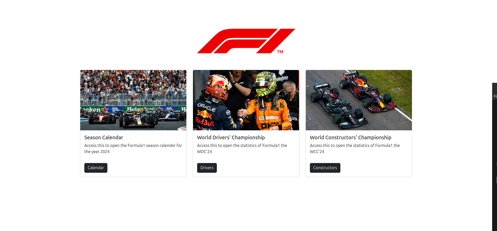

# Formula 1 Stats App

Overview

The Formula 1 Stats App provides real-time standings and performance data for the current Formula 1 season. The app pulls data from the Ergast API to display the latest driver and constructor standings, race results, and cumulative points progress. The app offers a dynamic and interactive experience, with visualizations to track the progress of both drivers and constructors throughout the season.
Features

  1. Dynamic Driver Standings: Displays current driver standings, including points and rankings, with the cummulative points of the drivers throughout the season.
  2. Constructor Standings: Shows the top 5 constructors and their cumulative points throughout the season.
  3. Displays the race calander of the season, and highlights the next race on the top.
  4. Ability to view the racing circuits on an interactive map
  5. Interactive Charts: Provides interactive plots of drivers' and constructors' performance throughout each race.
  6. Caching: Uses caching to minimize API calls and improve load times for frequently accessed data.
  7. Customizable Design: Allows for a custom, Formula 1-themed design with team colors and logos.

### Technologies Used

  Backend: Python, Flask
  Frontend: HTML, CSS, Bootstrap
  APIs: Ergast API for Formula 1 data
  Caching: Flask-Caching
  Visualization: Plotly for interactive graphs, folium for interactive maps.

## Getting Started

Prerequisites

Before setting up the app, ensure that you have the following installed:

  Python 3.x+
  pip (Python package installer)

Installation

  Clone the repository:

  ```
  https://github.com/x0byte/f1_calender_app.git
  ```


Create and activate a virtual environment (optional but recommended):

```
python -m venv venv
source venv/bin/activate  # On Windows, use `venv\Scripts\activate`
```

Install dependencies:

```
  pip install -r requirements.txt
```

Running the App

To start the app locally, use the following command:

```
python3 main.py
```

This will start the server at http://127.0.0.1:5000/. You can now access the app in your browser.


The app fetches data from the Ergast API for the current Formula 1 season. The API provides:

    Driver Standings: Current rankings and points of each driver.
    Constructor Standings: Rankings and points for each constructor.
    The Race Calander: Details about the races throughout the season.

This data is cached using Flask-Caching to reduce API call frequency, improving performance.

### Interactive Charts

The app uses Plotly to generate interactive graphs that display:

  Driver and constructor points progress over the course of the season.
  Cumulative points updates after each race.

These graphs are fully interactive, allowing users to hover over the lines to see detailed data for each race.

## How it looks in action




